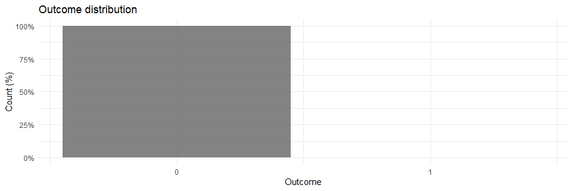

```{r setup, include=FALSE}
knitr::opts_chunk$set(
  echo = FALSE, message = FALSE, warning = FALSE
)

# library(DiagrammeR)
library(dplyr)
library(tidyr)
library(ggplot2)
library(purrr)
library(firasans)
library(broom)
library(kableExtra)

extrafont::loadfonts(quiet = TRUE)
library(firasans) # Install via  remotes::install_github("hrbrmstr/firasans")

theme_set(
   theme_ipsum_fsc()
)

fish <- readRDS(here::here("data/fish.rds"))
```

# Intro

1. Das Poisson-Modell im groben
2. Verletzte Annahmen und andere Unannehmlichkeiten
3. Dispersion: Zu viel oder zu wenig
4. Zeros
5. Alternative Modelle

# Zähldaten

Wir haben eine zu erklärende Variable $Y$, was machen wir damit?  
In einer perfekten Welt:

- $Y \in \mathbb{R}$: Lineares Modell
- $Y \in [0, 1]$: Logistische Regression
- $Y \in \mathbb{N}_0$: Poisson Regression

# Poisson Modell

$$\begin{aligned}
Y \sim \mathrm{Poisson}(\mu): \quad
\mathrm{P}(Y = y) = \frac{\mu^y \exp(-\mu)}{y!}, \quad y \in \mathbb{N}_0
\end{aligned}$$

```{r poissondists, fig.cap="Poisson-Verteilungen mit ausgewählten Parametern."}
map_df(c(0.5, 1, 2, 5, 10, 15), ~{
  tibble(
    mu = .x,
    x = 0:20,
    poi = dpois(x, mu)
  )
}) %>%
  ggplot(aes(x = x, y = poi, color = factor(mu), fill = factor(mu))) +
  geom_path(aes(group = mu), linetype = "dotted") +
  geom_point(shape = 21, color = "black", size = 2.5, stroke = .2) +
  #geom_segment(aes(x = x, xend = x, y = 0 , yend = poi)) +
  scale_color_viridis_d(direction = -1, guide = FALSE) +
  scale_fill_viridis_d(
    direction = -1, guide = guide_legend(
      keywidth = .5,
      nrow = 1,
      direction = "horizontal"
      )
  ) +
  labs(
    title = "Poi(\u00b5)",
    x = "y", y = "Poi(y, \u00b5)", fill = "\u00b5"
  ) +
  theme(legend.position = c(.7, 1))
```


# Beispiel: Fischfang

Datensatz `fish`: An einem Wochenendausflug in einen Park wurden 250 Gruppen nach der Anzahl ihrer geangelten Fische befragt

- `count`: Anzahl gefangener Fische
- `camper` [0, 1]: Haben sie ein Wohnmobil mitgebracht?

<br/>

# Fischfang: Einfaches Poisson-Modell

```{r fish-pois-1, attr.output = "fragment"}
fish_poisson <- glm(count ~ camper, family = poisson(), data = fish)

tidy(fish_poisson, exponentiate = FALSE) %>%
  transmute(term, estimate, exp_estimate = exp(estimate)) %>%
  kable(
    format = "html", digits = 2,
    caption = "Poisson-Modell: count ~ camper",
    col.names = c("Term", "Koeffizient", "Koeffizient (exp)")
  ) %>%
  kable_styling()
```

- `camper1`: Gruppen, die einen Wohnwagen mitbrachten, fingen ~3 mal so viele Fische wie Gruppen ohne Wohnwagen
- Ein *exposure*-Parameter / `offset` (z.B. `log(days)`) normiert auf Untersuchungszeiträume (in diesem Fall nicht notwendig)

# Ein Blick auf die Daten

```{r fish-summary}
fish %>%
  summarize(
    Mean = mean(count), Var = var(count), Min = min(count), Max = max(count)
  ) %>%
  kable(caption = "Summary: count") %>%
  kable_styling()
  
fish %>%
  filter(count <= 20) %>%
  count(camper, count) %>%
  ggplot(aes(x = count, y = n, fill = camper)) +
  geom_col(position = position_dodge2(preserve = "single")) +
  scale_fill_brewer(palette = "Set2", labels = c("Ohne Camper", "Mit Camper")) +
  labs(
    title = "fish: Barchart nach camper",
    subtitle = "x-Achse limitiert auf [0, 20]",
    x = "Anzahl Fische", y = "Count", fill = ""
  ) +
  theme(legend.position = "bottom")
```

# Problem 1: Overdispersion

Zentrale Eigenschaft der Poisson: **Equidispersion**

$$
\mu = \mathbb{E}(Y) = \mathbb{V}(Y)
$$

- Poisson–**Over**dispersion: $\mathbb{E}(Y) < \mathbb{V}(Y)$
  - → **Unter**schätzte Standardfehler
- Poisson–**Under**dispersion: $\mathbb{E}(Y) > \mathbb{V}(Y)$  
  - → **Über**schätzte Standardfehler
- Allgemein "Overdispersion": $\mathbb{V}(Y\ |\ X) > \mathbb{V}(Y)$

# Overdispersion (2)

Mögliche Gründe:

- Fehlspezifiziertes Modell (fehlende Prädiktoren, Transformationen...)
- Korrellierte Daten / verletzte Unabhängigkeitsannahme
   - → robuste Varianzschätzer (sandwich)
- Ausreißer
- Missing values (MNAR)
- Zero-Inflation <small>(dazu später mehr)</small>
- etc. pp.

# Overdispersion (3): Dispersionsstatistik

$$
D = \frac{\chi_{\text{Pearson}}^2}{\mathrm{df}}
$$

- $D = 1$: Poisson!
- $D > 1$: Overdispersion
- $D < 1$: Underdispersion
- Auch für andere Modelle (z.B. NB) anwendbar
- Over/underdispersion jeweils **relativ zum Modell**!

# Problem 2: Zero-Inflation

- Wenn das Modell deutlich weniger Nullen vorhersagt, als tatsächlich vorliegen
- Erhöht Modellvarianz, verzerrt bedingten Erwartungswert
- Kontrolle: Beobachtete und erwartete Häufigkeiten des Modells vergleichen

<br/>
<div class="fragment">
```{r compare-observed-expected}
observed_v_expected <- fish %>%
  count(count, name = "observed") %>%
  mutate(
    expected = purrr::map_dbl(count, ~{
                  dpois(.x, fitted(fish_poisson)) %>%
                    sum() %>%
                    round(2)
                }),
    difference = observed - expected
  ) 

observed_v_expected %>%
  head(3) %>%
  kable(
    caption = "fish: Observed + expected counts",
    col.names = c("Fische", "Beobachtet", "Erwartet (Poisson)", "Differenz"),
  ) %>%
  kable_styling()
```
</div>

# Modelle

```{r model-graph-png, fig.align="center", out.width="60%"}
knitr::include_graphics(here::here("graphs/model-graph.dot.png"))
```

# Negativ-Binomial (NB2)

- Mixture aus Poisson + Gamma-verteilter Varianz
- $\mathbb{E}(Y) = \mu$ und $\mathrm{Var}(Y) = \mu + \alpha \mu^2$ und $\alpha \ge 0$
- $\alpha$ ist der Dispersionsparameter: $\alpha = 0$ entspräche Poisson

- → Varianz kann größer/gleich Erwartungswert sein 
- → **Overdispersion** modellierbar
- **Cavetat 1**: $\alpha < 0$ ist *nicht* möglich, also **keine Underdispersion**
- **Caveat 2**: Insb. in R verwendet: $\theta = \frac{1}{\alpha}$!
- **Caveat 3**: Parameter wird außerhalb des GLM geschätzt

# NB-Varianten

- Es gibt zwei Parametrisierungen der NB: NB1, NB2
- $\mathrm{Var}(Y) = \mu + \alpha \mu^{\boldsymbol{\rho}}$
   - $\rho = 1 \to \mathrm{NB1}$
   - $\rho = 2 \to \mathrm{NB2}$ (eigentlich der Default)
- Mögliche Entscheidungshilfe (oder Alternative): 
- **NB-P**-Modell: Schätzt $\rho$ als Parameter

# Poisson Inverse Gaussian (PIG <small>(sic!)</small>)

- NB = Poisson + Gamma-verteilte Varianz
- PIG = Poisson + Inverse Gaussian-verteilte Varianz
- Ähnliche Nachteile wie NB (nur Overdispersion)
- Alternative zur NB für "*highly overdispersed data*"
- Softwareimplementation: Spärlich?

# Generalized Poisson (GP)

- Verallgemeinerung der Poisson mit zusätzlichem Parameter $\delta$
- Unterschied zu NB: Kann **Over**- _und_ **under**dispersion
- Theoretisch ist die GP das flexibelste Werkzeug...
- In der Praxis: Softwareimplementation "geht so"
- In SAS z.B. via `NLMIXED`, `FMM` (nicht getestet)
- in R: `gamlss` oder `VGAM`: Unterschiedliche Parametrisierungen, semi-nachvollziehbare Dokumentation, numerische Instabilität für kleine Erwartungswerte

# Conway-Maxwell Poisson (COMP)

$$
\begin{align}
P(X = x) &= \frac{\lambda^x}{(x!)^\nu} \frac{1}{Z(\lambda, \nu)}, \quad x = 0, 1, 2, \ldots \\
Z(\lambda, \nu) &= \sum_{j = 0}^\infty \frac{\lambda^j}{(j!)^\nu} \\
\\
\lambda > 0&, \nu \ge 0
\end{align}
$$


# COMP (2)

- Andere Verallgemeinerung als die GP
- Parameter $\lambda$, $\nu \ge 0$
- Eierlegende Wollmilchsau?
- Grenzfälle (link: $\log \lambda$): 
  - Poisson ($\nu = 1$)
  - Bernoulli ($\nu \to \infty$), $P(X = 1) = \frac{\lambda}{1 + \lambda}$
  - Geometrisch ($\nu = 0$)
- $\mathrm{Var}(Y) \approx \frac{1}{\nu} \mathbb{E}(Y)$

# Zero-Inflated Modelle

*Mixture distribution*: Mischung zweier PMFs $g_1, g_2$ entsprechend Proportion $p$ 

$$P(Y = y) = p \cdot g_1(y) + (1-p) \cdot g_2(y)$$

- ZI-Verteilung: Count-Verteilung gemischt mit Null-Verteilung
- **Zero-Inflated Poisson**: Poisson-Verteilung gemischt mit Nullverteilung
- Mixture proportion: $\pi \in [0, 1]$

<div class="fragment">
$$
\begin{aligned}
P(Y = 0) &= \pi + (1-\pi) \cdot e^{-\mu} \\
P(Y = y) &= (1 - \pi) \cdot \frac{\mu^y e^{-\mu}}{y!}, \quad y = 1, 2, 3, \ldots
\end{aligned}
$$
</div>

# ZI (2): Grundidee

Annahme:  

- Es gibt 0-counts aus zwei unterschiedlichen Prozessen
- Beispiel `fish`: 
- Nicht alle Gruppen haben am Wochenende geangelt!
- *Alle* wurde nach der Anzahl der Fische befragt

<div class="fragment">
```{r zi-principle-plot}
nsim <- 10^4
meansim <- 2

tibble::tibble(
  counts = rpois(n = nsim, lambda = meansim),
) %>%
  count(counts, name = "Poisson") %>%
  mutate(
    Zeros = floor(Poisson/1.25),
    Zeros = ifelse(counts > 0, 0, Zeros)
  ) %>%
  gather(source, freq, Poisson, Zeros) %>%
  mutate(source = forcats::fct_rev(source),
         freq = freq/nsim) %>%
  ggplot(aes(x = counts, y = freq, fill = source)) +
  geom_col(alpha = .75) +
  scale_x_continuous(breaks = seq(0, 12)) +
  scale_fill_brewer(palette = "Set1", labels = c(Zeros = "Certain Zeros", Poisson = "Poisson-Modell")) +
  labs(
    title = "Schaubild: Zero-Inflated Poisson",
    subtitle = "Nullen in den Daten: Certain zeros + count zeros",
    x = "Count", y = "Anteil an Gesamtsichtprobe", fill = "",
    caption = "Simulierte Daten"
  ) +
  theme(legend.position = "bottom")
```
</div>

# ZI: Schätzung

- Modell-Output enthält zwei **zusammenhängende** Komponenten:
- Count-Modell: Reguläre Interpretation, analog Poisson
- Logit-Modell für $\pi$: Wahrscheinlichkeit, eine "Certain Zero" zu sein

<div class="fragment">
```{r zi-fish-model}
m_zip <- pscl::zeroinfl(count ~ camper, data = fish)

exp(m_zip$coefficients$count) %>% 
  tibble::enframe(name = "Term", "Coef (exp)") %>%
  kable(caption = "Count Modell")

exp(m_zip$coefficients$zero) %>% 
  tibble::enframe(name = "Term", "Coef (exp)") %>%
  kable(caption = "Zero Modell")
```
</div>

# Modellvergleich

- Im Allgemeinen: AIC, BIC (ggf. adjustierte Abdwandlungen)
- Vergleich der Prognosegüte
- Likelihood Ratio Test für **geschachtelte** Modelle
- Geschachtelt z.B.: Poisson $\subseteq$ NB ($\alpha = 0$)
- Nicht geschachtelt: PIG & NB
- **Kontroverse**: ZI-Modelle
- Poisson $\subseteq$ ZIP (laut Wilson (2015)), aber ältere Literatur sieht das anders
- Für **ungeschachtelte Modelle**: Vuong-Test

# Extrembeispiel

- Mittelwert = 0.00088
- Varianz = 0.00088
- Dispersion = 0.76
- Expected counts (Poisson) ≈ Observed counts (± 0.01%)

<div class="fragment">
```{r extrembeispiel-barchart}

```
</div>

# TL;DR: What do?

```{r decision-graph-png, fig.align="center", out.width="60%"}
knitr::include_graphics(here::here("graphs/decision-guide.dot.png"))
```

# Done!

>- In Voll: [poisson.tadaa-data.de](https://poisson.tadaa-data.de)
>- Source: [git.tadaa-data.de/lukas/poisson-regression](git.tadaa-data.de/lukas/poisson-regression)
